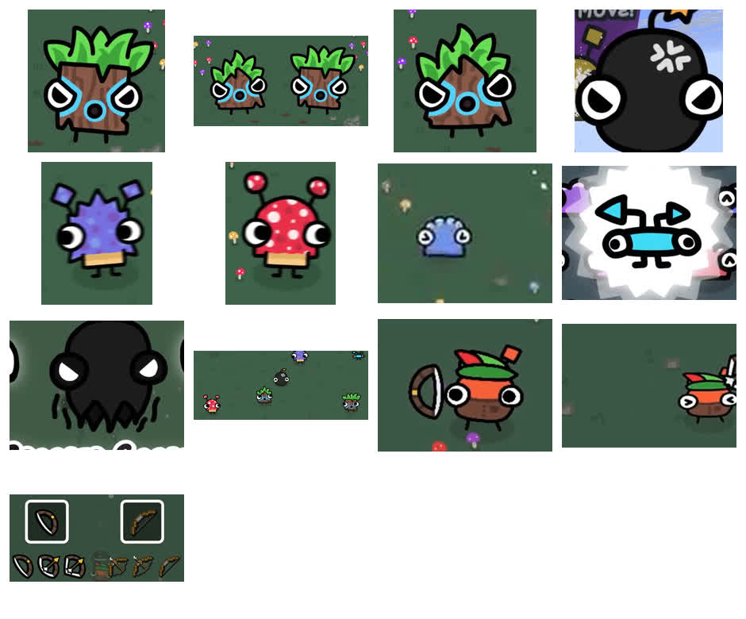

# Asset Crops

These are low-resolution visual reference crops from the Icoso video. They are not runtime assets and should not be shipped with the game.

Use them to study:

- silhouette;
- outline weight;
- color blocking;
- facial expression;
- enemy family differences;
- bow charge readability.

Quick overview:

## Player

- `player/bowbert_close_reference.png`: close view of Bowbert with bow.
- `player/bowbert_gameplay_reference.png`: small gameplay-scale Bowbert.

## Weapon

- `weapons/bow_states_reference.png`: relaxed and drawn bow states.

## Enemies

- `enemies/dart_goober_body_reference.png`: square Dart Goober body.
- `enemies/dart_tri_goober_reference.png`: triangular Dart Goober variant.
- `enemies/dart_goober_pair_reference.png`: side-by-side family comparison.
- `enemies/red_shroom_reference.png`: red mushroom enemy.
- `enemies/purple_shroom_reference.png`: purple spiky mushroom enemy.
- `enemies/slime_large_reference.png`: large slime style reference.
- `enemies/slime_gameplay_reference.png`: gameplay-scale slime reference.
- `enemies/kaboomlet_reference.png`: bomb enemy reference.
- `enemies/spooper_gooper_reference.png`: ghost enemy reference.

## Group

- `groups/enemy_lineup_reference.png`: relative scale and family comparison.
