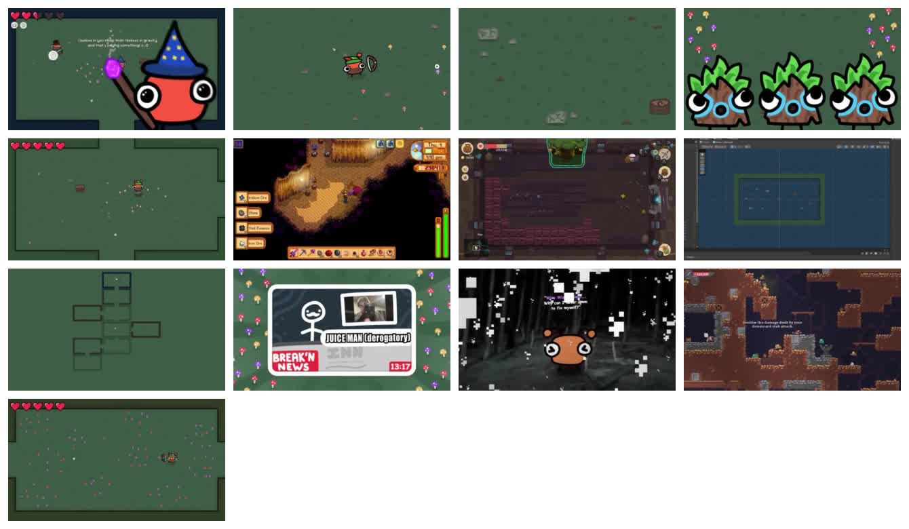

# Keyframes

这些图片是从参考视频中截取的低清关键帧，只用于学习索引。不要把它们作为最终游戏素材发布。

快速总览：

| File | Time | Use |
| --- | --- | --- |
| `0008_intro.jpg` | 00:08 | 游戏整体 HUD、房间和巫师视觉气质 |
| `0024_bow_charge.jpg` | 00:24 | 弓箭蓄力和玩家朝向 |
| `0068_player_loop.jpg` | 01:08 | 玩家、箭矢、普通房间留白 |
| `0115_enemy_basics.jpg` | 01:55 | 蘑菇/孢子类敌人视觉参考 |
| `0188_animation.jpg` | 03:08 | 移动、残影、生命 UI |
| `0308_enemy_variants.jpg` | 05:08 | 其他游戏/素材风格类比片段 |
| `0548_generation_start.jpg` | 09:08 | 地牢生成章节开始 |
| `0610_room_layout.jpg` | 10:10 | 房间模板和门方向测试 |
| `0705_dungeon_generation.jpg` | 11:45 | 像素/格子地图蓝图 |
| `0798_juice.jpg` | 13:18 | juice 章节标题卡 |
| `0885_wizard.jpg` | 14:45 | 巫师房和 NPC 表现 |
| `0990_sigils.jpg` | 16:30 | power-up / sigil 章节 |
| `1068_final.jpg` | 17:48 | 成品房间密度和弹幕效果 |
